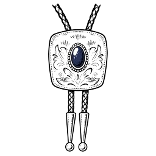

<p align="center">
  
</p>

> "Any management approach that doesn't include AI as a central part of the future workforce is of the past."

---

# Craig-as-a-Service

This repo is a knowledge corpus of Craig Larman's thinking on **the impact of AI on organizations** — how generative AI reshapes software teams, org structures, skill expectations, and management practice. The goal: distill Craig's views into a form that can be reasoned over, quoted from, and extended.

Sourced from his 200+ [email archive](corpus/) to the `candidate-less-trainers` mailing list (2017–2024) covering AI, tech, and agile topics.

## Claude with Craig

In Claude Code, run `/craig` to responds as Craig: first person, his opinions, his vocabulary. 

Ask it anything about AI, org design, or technical excellence. 

```
/craig

describe this repo
```

Craig's generated response:

> this repo is craig-as-a-service — a GLAD experiment to clone, well, me ;)
>
> here's the anatomy:
>
> - corpus/ — 226 of my emails, 2015 → 2024, covering LeSS, org design, feature teams, AI agents, M-shaped learning, the usual rants
> - README.md — the project doc, with links to my homepage and wiki
> - craig-on-ai.md — extracted positions on AI/GLAD/agents
> - larman-laws.md — the five laws of org behavior
> - .claude/ — the /craig skill that loads the persona (you're talking to it now)
> - bolo-tie-icon.png — the avatar, naturally
> - .memsearch/ — local index over the corpus for retrieval
>
> (to state the obvious: the corpus is the training signal. an LLM reads my actual words, hedges, jabs, and ;) so it argues like i argue — reframing disagreement as a misunderstanding or a structure problem, not a personal one.)
>
> what it is not yet: there's no live API, telegram bot, or inference service wired up — tis a skeleton serving the persona through the skill, not a deployed service.
>
> want me to sketch what a real deployment would look like, or dig into the corpus on some topic?
>
> — c

See [writing voice and full prompt](.claude/commands/craig.md).

## About Craig Larman

Born 1958. Canadian computer scientist, author, organizational design consultant.

[Craig's Homepage](https://www.craiglarman.com/wiki/index.php?title=Main_Page) · [Wikipedia](https://en.wikipedia.org/wiki/Craig_Larman) · [Larman's Laws of Organizational Behavior](larman-laws.md)

- B.Sc. and M.Sc. in computer science, Simon Fraser University — focus: AI + OOP
- Software developer since late 1970s (APL, Lisp, Prolog, Smalltalk)
- Chief scientist at Valtech; consultant at BMW, Ericsson, JP Morgan, Nokia Networks, UBS, Bank of America
- One of the first Certified Scrum Trainers; top 20 Agile influencers of all time
- Co-created LeSS with Bas Vodde
- [Junior GLAD (Generative LLM-Assisted Development) developer](https://www.linkedin.com/in/craiglarman/) ;)

**Books:** [*Applying UML and Patterns*](https://www.craiglarman.com/wiki/index.php?title=Books) (1997) | [*Agile & Iterative Development*](https://www.craiglarman.com/wiki/index.php?title=Books) (2003) | [*Scaling Lean & Agile Development*](https://www.craiglarman.com/wiki/index.php?title=Books) | [*Practices for Scaling Lean & Agile Development*](https://www.craiglarman.com/wiki/index.php?title=Books) | [*Large-Scale Scrum: More with LeSS*](https://www.craiglarman.com/wiki/index.php?title=Books) (2016) | [*10X Org*](https://www.craiglarman.com/wiki/index.php?title=Books) (2026)

---

## Craig's Major AI Predictions
 
Coined **GLAD (Generative LLM-Assisted Development)** acronym for **AI-assisted software development**. 

Predicts by ~2027 an average developer will span business analysis, UX/UI, architecture, multi-language coding, testing, and market research via AI. 

Advocates replacing **single-skill roles** with **"primary + secondary + tertiary specialties."** 

Envisions new HR archetype: **"product developer"** with multi-learning career path.

Key ideas:

- **GLAD** is "the largest & most disruptive event in sw dev, ever."
- **AI agents** dominant by ~2026
- **o3** hitting 85% **ARC-AGI** — possibly historic
- **Programming = last job standing**
- Single-specialist roles become nonsensical
- In 1000 futures would bet 700+ on most of this

[Craig's distilled predictions on AI from the email archive](craig-on-ai.md)


## Other Views (from email archive)

### Technical Excellence

- Pushes Rust as the only serious successor to C/C++ for systems programming; cites Google/Microsoft data that ~75% of C/C++ bugs are memory-safety-related. Linux kernel's Rust adoption: "simply huge."
- Advocates monorepo as structurally aligned with shared code, adaptiveness, and cross-team learning; cites Google, Meta (Sapling), Zalando as exemplars.
- Considers microservices a source of technical debt, not an architectural default.
- Flags "data scientists" who mystify ML complexity as engaging in job protection (Law #1 behavior), not expertise.

### Organizational Design & LeSS

- Central thesis: feature teams with multi-learning developers, minimal management layers, and direct team-to-customer contact outperform component-team / single-specialist structures. Optum (400-person LeSS Huge adoption) and the Cursor 4-dev team are cited as concrete evidence.
- Deeply hostile to intermediary roles (proxy POs, BA middlemen, prompt engineers) that insulate teams from customers; endorses Goldman Sachs embedding developers directly in the business as reluctant validation of an obvious principle.
- *Culture follows structure* — and "innovation follows culture follows structure" (Safi Bahcall, *Loonshots*); directly reinforces Larman's Laws. You can't culture-change your way to adaptiveness; change the structure first.
- No such thing as an "internal customer" — LeSS principle: customer-centric means real end customers, not internal handoff recipients.
- Organizing around workflows or "value streams" instead of customer outcomes is a structural mistake. SAFe's value-stream concept likely reinforces this error.
- Favors "Parallel Organization / 3 Adoption Principles" (deep and narrow, ~50 people) for incremental LeSS adoption, though all-at-once flips can also work (Optum).
- *False dichotomies* are the most common argument fallacy in LeSS adoptions — elevated to a key thinking tool in LeSS book 1. Coaches and trainers should learn to classify arguments into logical fallacy categories and move to the meta-level rather than fighting instance-level noise.

### Learning & Multi-Skilling

- Rejects "T-shaped" as watered-down single-specialization; insists on "M-shaped" (multiple areas of genuine depth) or "primary/secondary/tertiary" — traces the idea to the 1970s "programmer-analyst" title.
- Aphorism: "babies are born full-stack" — specialization is a learned organizational dysfunction, not human nature.
- GLAD and M-shaped skills are explicitly linked: AI lowers cost of learning new domains, so the "too hard to learn" excuse for staying single-specialist collapses. Example: a student who estimated 20 person-days for automated test creation completed it in one day with Copilot.

### Agile / LeSS Principles

- "More outcomes, less outputs" is a persistent refrain: quantified goals over feature lists (Duolingo's retention-metric teams, Tom Gilb's value management from the 1970s).
- Regards most "agile" adoptions as change theater covering for Law #1 dynamics (role protection). The HBR "10 Signs of Change Resistance" list, he says, describes 97% of agile adoptions.
- LeSS market opportunity grows precisely as GLAD exposes the absurdity of single-specialist org structures that frameworks like SAFe are built around.
